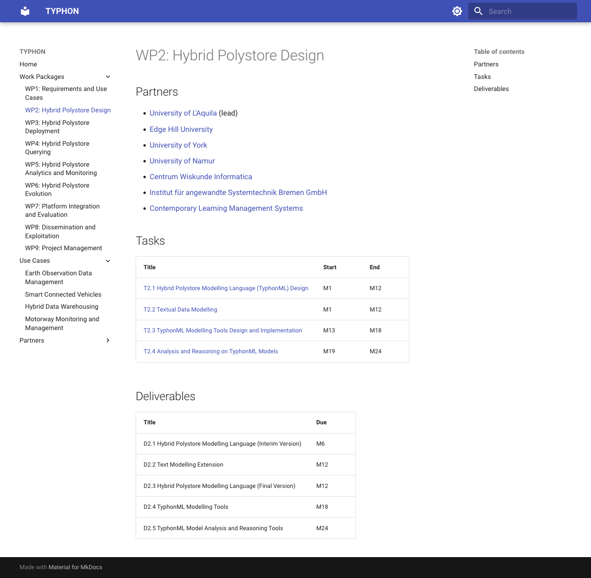

# ProjectDocs Material

A domain-specific language (PDL) for modelling collaborative research projects and a generator that produces an [MkDocs Material](https://squidfunk.github.io/mkdocs-material/) website from a PDL model.



## Running the Generator

To generate the website from the project model, you need to run `gradle run` from the `pdl` directory. The generator will produce an `mkdocs.yml` file in the `mkdocs` directory, as well as Markdown files for the different partners, work-packages and tasks of the project under `mkdocs/docs/`.

## Serving the Website

To serve the website, you need to run the following command from the `mkdocs` directory:

### Windows

```
docker run --rm -it -p 8000:8000 -v %cd%:/docs/ squidfunk/mkdocs-material
```

### Linux / Mac

```
docker run --rm -it -p 8000:8000 -v ${PWD}:/docs/ squidfunk/mkdocs-material
```

You can then access the generated website at http://localhost:8000.
